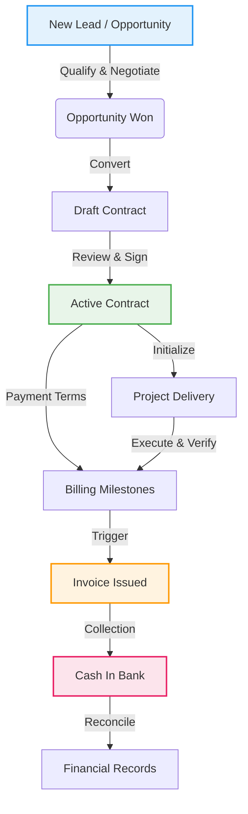

# System Data Flow (L2C Lifecycle)

This document describes the core data flow of the Lead-to-Cash (L2C) system, detailing how data transforms and moves through different modules: Opportunities (CRM), Contracts, Project Delivery, and Finance.

## High-Level Data Flow Diagram

## Detailed Flow Steps

### 1. Opportunity Phase (CRM)
- **Input**: User creates a new Lead/Opportunity with Customer info, Estimated Value, and Close Date.
- **Process**: Sales team updates stages (Proposal -> Negotiation).
- **Output**: changing Status to `Won` triggers the next phase.

### 2. Contract Phase
- **Input**: Data from `Won` Opportunity (Customer, Amount, Scope) is pre-filled into a new Contract.
- **Process**: 
  - Risk Assessment & Approval workflows.
  - Payment Terms definition (which generates future Billing Milestones).
  - Status moves from `Draft` -> `Signed`.
- **Output**: A specific `Active Contract` linked to the original Opportunity.

### 3. Project Delivery Phase
- **Input**: `Active Contract` serves as the baseline for the Project.
- **Process**:
  - Resource Allocation (assigning team members).
  - Milestone Tracking (delivering work against contract scope).
  - Cost Tracking (logging labor, purchases, and expenses).
- **Output**: Verified Milestones that are ready for billing.

### 4. Finance & Billing Phase
- **Input**: `Billing Milestones` from the Contract/Project.
- **Process**:
  - Finance team generates an **Invoice** for a reached milestone.
  - Invoice Status: `Draft` -> `Issued` -> `Sent`.
- **Output**: An issued Invoice sent to the customer.

### 5. Collection Phase (Cash)
- **Input**: Customer payment actions.
- **Process**:
  - Recording Payment Records against specific Invoices.
  - Updating Invoice Status to `Partially Paid` or `Paid`.
- **Output**: Updated Cash Flow statements and revenue recognition.

## Data Relationships (ERD Simplified)

- **Customer** `1:N` **Opportunities**
- **Opportunity** `1:1` **Contract** (typically)
- **Contract** `1:1` **Project**
- **Contract** `1:N` **Milestones**
- **Contract** `1:N` **Invoices**
- **Invoice** `1:N` **Payments**
