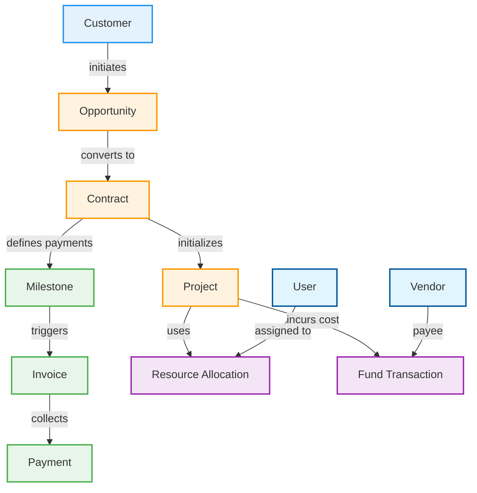

# System Architecture & Relationships (系统架构与关联关系)

本系统采用经典的 Lead-to-Cash (L2C) 业务流。本文档通过可视化图表和数据字典，揭示各模块间的深层关联。

## 1. 核心业务流转关系 (Core Business Flow)

### 实体关系图 (Entity Relationship Diagram)

### 关键流转逻辑 (Key Transition Logic)

1.  **商机 -> 合同 (Opp to Contract)**
    *   **触发点**: 商机状态变更为 `Won`。
    *   **数据继承**: 合同自动继承商机的 `Customer`, `Title`, `WinningPrice`。
    
2.  **合同 -> 项目 (Contract to Project)**
    *   **触发点**: 合同状态变更为 `Signed` -> 点击 "Initialize Project"。
    *   **数据继承**: 项目继承合同的 `ContractNumber` 作为关联键，初始状态为 `Initialization`。

3.  **合同 -> 财务 (Contract to Finance)**
    *   **桥梁**: `Milestones` (里程碑)。
    *   **逻辑**: 合同中定义“付款节点”（如：首付款 30%）。当项目交付达到该里程碑时，财务模块基于此里程碑生成 `Invoice`。

---

## 2. 数据字典与配置 (Data Dictionary & Settings)

### 基础配置 (Master Data)

| 实体 | 模块位置 | 用途 | 关联模块 |
| :--- | :--- | :--- | :--- |
| **Customer** | `/customers` | 客户档案，包含联系人、行业、账期偏好。 | Opportunity, Contract, Invoice |
| **User** | `/users` | 内部员工账号，包含角色 (Admin/User) 和职位。 | Project (Resource), Opportunity (Owner) |
| **Vendor** | `/vendors` | 供应商/合作伙伴，包含评级、品牌、服务类型。 | Project (Cost), Fund (Payout) |

### 核心枚举值 (Key Enums)

**1. 商机阶段 (Sale Stage)**
*   `Prospecting`: 潜在客户
*   `Qualification`: 资格确认
*   `Proposal`: 方案报价
*   `Negotiation`: 商务谈判
*   `Closed Won/Lost`: 赢单/输单

**2. 合同状态 (Contract Status)**
*   `Draft`: 草稿
*   `CustomerReview`: 客户评审
*   `InternalReview`: 内部评审
*   `CustomerSeal`: 客户盖章
*   `InternalSeal`: 公司盖章
*   `Signed`: 已归档

**3. 项目状态 (Project Status)**
*   `Initialization`: 初始化
*   `Planning`: 计划中
*   `Execution`: 执行中
*   `Delivery`: 交付/验收
*   `Completed`: 已完结

**4. 资金交易类型 (Fund Transaction Type)**
*   `ADVANCE`: 垫资 (公司出钱)
*   `REIMBURSEMENT`: 报销 (员工报销)
*   `PAYOUT`: 付款 (付给 Vendor)
*   `COLLECTION`: 回款 (客户付款)

---

## 3. 全局提示词建议 (System-Wide Prompting)

如果您需要让 AI 理解整个系统的上下文，可以将以下内容作为 `System Prompt` 或开场白：

> "你正在维护一个名为 **Lead-to-Cash (L2C)** 的全流程业务系统。
> 该系统基于 **Next.js + NestJS** 开发。
> 
> **核心业务链**：
> 1.  **商机 (Opportunity)**：销售漏斗的入口。
> 2.  **合同 (Contract)**：确立法律和财务边界，定义 **里程碑 (Milestones)**。
> 3.  **交付 (Project)**：履行合同义务，产生 **成本 (Cost)**。
> 4.  **财务 (Finance)**：基于里程碑开具 **发票 (Invoice)** 并回笼资金。
> 
> **关键原则**：
> *   **数据一致性**：`Won Price` 在合同和项目中必须保持一致。
> *   **状态驱动**：所有核心实体的流转都由 Status 驱动（如 Signed 触发 Project 创建）。"
